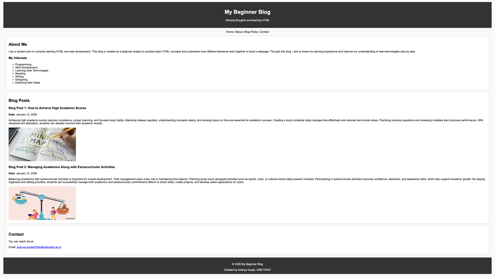

# HTML Blog Site

**Live Demo**  
https://ananyagpt1105.github.io/html-blog-site/

## Preview

## About the Project
This project is a simple blog webpage created using HTML5 semantic elements. The page demonstrates how a basic blog layout can be structured using sections such as a header, multiple blog articles, and a footer.

## Features
- Blog layout with multiple posts
- Structured content using HTML5 semantic elements
- Clean and simple webpage design

## Technologies Used
- HTML

## Concepts Practiced
- Semantic HTML5 elements (`header`, `section`, `article`, `footer`)
- Structuring webpage content
- Basic webpage layout
